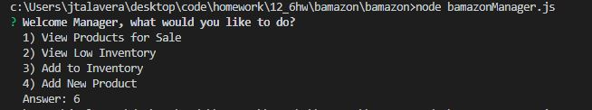
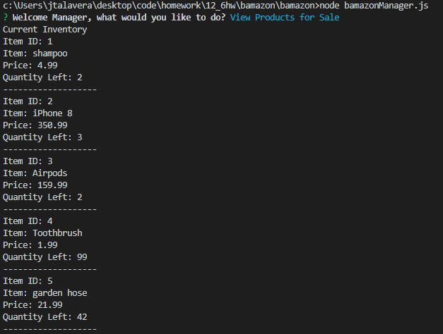
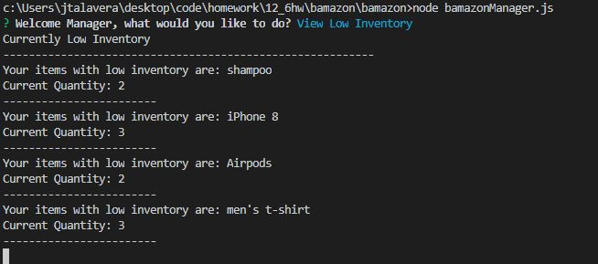
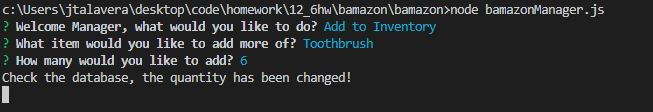
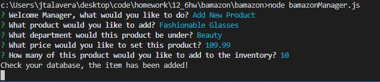
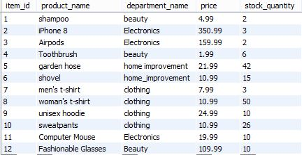

# bamazon

Bamazon is a makeshift backend node.js and mySQL application that takes in user orders and updates quantities left in storage in real time.


## Getting Started

This application uses 2 node modules

1. mySQL
2. inquirer

These modules are included as dependencies in the original node module. Be sure to either run

```
npm i
```

or
```
npm i mySQL
npm i inquirer
```

before beginning.

## Running the Application as a CUSTOMER

After running

```
node bamazonCustomer.js
```

in the terminal,  a list of purchasable items will be displayed:


## Purchasing Items

To purchase items enter the ID of the item you would like to purchase into the terminal. The terminal will also ask how many items you would like to buy, along with the total cost to the user.


Rerunning the terminal command, the quantity left will be updated depending on the quantity the user has input.


The mySQL database also automatically updates depending on the user input. Pay particular attention to the stock_quantity of  item_id 10, where the user orders 3 quantities.

### Before Inquiry


### After Inquiry


### Out of Stock Inquiries
If the amount that the customer orders exceeds the amount currently in the storage,the order will automatically be cancelled, prompting the user to either select a lower quantity or a different item.


This invalid inquiry leaves the database uneffected.


## Running the Application as a MANAGER

Running

```
node bamazonManager.js
```

in the terminal initiates Manager mode, which has added functionality. You will be given a prompt that will look like: 




### Viewing Current Products

Selecting

```
1) View Products for Sale
```
will prompt to the Manager all currently available products and their quantities, similar to below:




### Viewing Low Inventory

Selecting

```
2) View Low Inventory
```
will display to the Manager all currently stocked items with a quantity less than 5, similar to below:



### Add Quantities to Inventory

Selecting

```
3) View Low Inventory
```
will prompt the Manager to add and update quantities of an item that is currently in the database. Similar to below:




### Adding New Products to Inventory

Selecting

```
4) Add New Product
```

Will prompt the manager to add an entirely new product to the database, set the department, price, and initial quantity, as seen as below:



Your subsequent database should also be updated.




## Built With

* [mySQL] (https://www.npmjs.com/package/mysql) - database manager
* [inquirer] (https://www.npmjs.com/package/inquirer) - prompts interactive commands to user